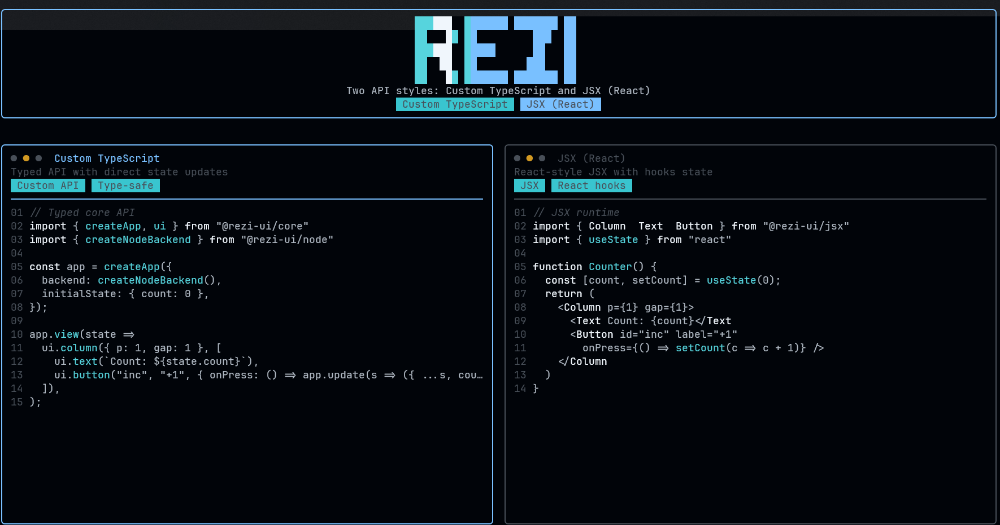
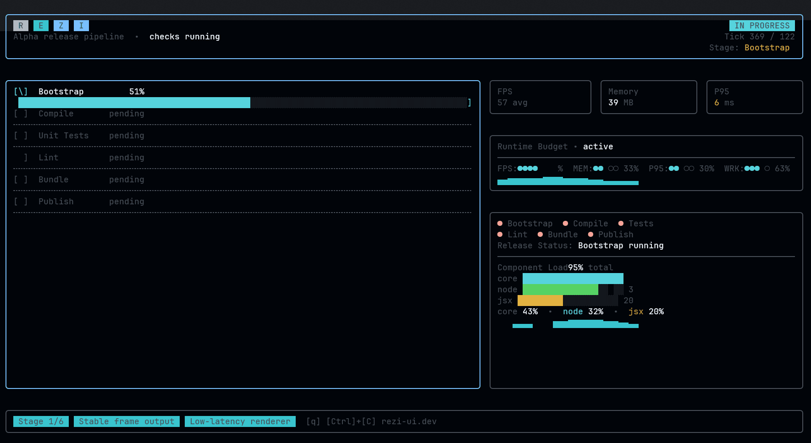
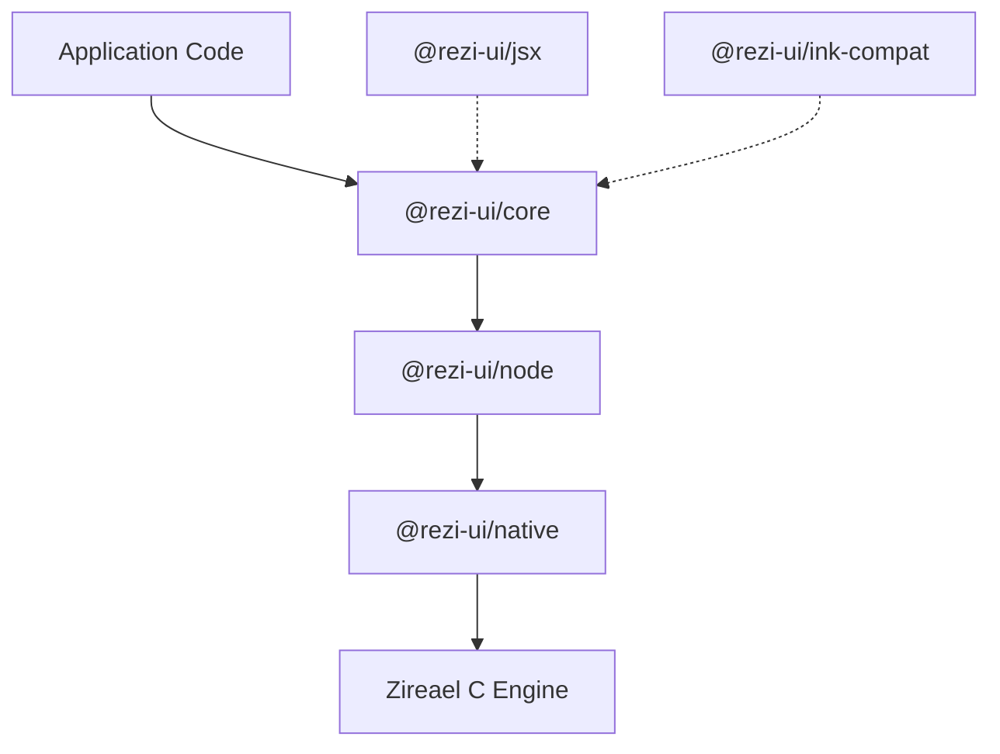

# Rezi

[](https://www.npmjs.com/package/@rezi-ui/core)
[](https://github.com/RtlZeroMemory/Rezi/actions/workflows/ci.yml)
[](https://rtlzeromemory.github.io/Rezi/)
[](LICENSE)

Rezi is a high-performance, code-first terminal UI framework for Node.js, built on the native [Zireael](https://github.com/RtlZeroMemory/Zireael) rendering engine.

## Highlights

- Declarative `ui.*` widget API with strong TypeScript types
- Native diff-based rendering with sub-millisecond updates
- Focus management, keybindings, and input handling built in
- 50+ widgets: forms, tables, trees, overlays, editors, and charts
- Theming system with semantic tokens and style props
- Optional JSX runtime and Ink compatibility layer
- Binary protocols (ZRDL/ZREV) for minimal overhead

## Preview





## About

- Description: High-performance terminal UI framework for Node.js, powered by Zireael
- Docs: https://rtlzeromemory.github.io/Rezi/
- License: Apache-2.0

## Quick example

```ts
import { createApp, ui, rgb } from "@rezi-ui/core";
import { createNodeBackend } from "@rezi-ui/node";

type State = { count: number };

const app = createApp<State>({
  backend: createNodeBackend(),
  initialState: { count: 0 },
});

app.view((state) =>
  ui.column({ p: 1, gap: 1 }, [
    ui.text("Counter", { style: { fg: rgb(120, 200, 255), bold: true } }),
    ui.button("inc", "+1", {
      onPress: () => app.update((s) => ({ count: s.count + 1 })),
    }),
    ui.text(`Count: ${state.count}`),
  ])
);

await app.start();
```

## Scaffold a New App

```bash
npm create rezi my-app
cd my-app
npm start
```

Choose a template: `dashboard`, `form-app`, `file-browser`, or `streaming-viewer`.

## Install

```bash
npm install @rezi-ui/core @rezi-ui/node
```

Node.js 18+ is required (18.18+ recommended). Prebuilt native binaries are provided for Linux, macOS, and Windows (x64/arm64).

## Architecture



## Documentation

- [Docs home](https://rtlzeromemory.github.io/Rezi/)
- [Getting started](https://rtlzeromemory.github.io/Rezi/getting-started/quickstart/)
- [Widgets](https://rtlzeromemory.github.io/Rezi/widgets/)
- [Styling & themes](https://rtlzeromemory.github.io/Rezi/styling/)
- [Examples](https://rtlzeromemory.github.io/Rezi/getting-started/examples/)
- [API reference](https://rtlzeromemory.github.io/Rezi/api/reference/)
- [Developer guide](https://rtlzeromemory.github.io/Rezi/dev/contributing/)

## Packages

| Package | Description |
|---|---|
| [`@rezi-ui/core`](https://www.npmjs.com/package/@rezi-ui/core) | Runtime-agnostic widgets, layout, themes, forms, keybindings |
| [`@rezi-ui/node`](https://www.npmjs.com/package/@rezi-ui/node) | Node.js backend and worker model |
| [`@rezi-ui/native`](https://www.npmjs.com/package/@rezi-ui/native) | N-API addon binding to Zireael |
| [`@rezi-ui/ink-compat`](https://www.npmjs.com/package/@rezi-ui/ink-compat) | Ink compatibility layer |
| [`@rezi-ui/jsx`](https://www.npmjs.com/package/@rezi-ui/jsx) | JSX runtime |
| [`@rezi-ui/testkit`](https://www.npmjs.com/package/@rezi-ui/testkit) | Test utilities and fixtures |
| [`create-rezi`](https://www.npmjs.com/package/create-rezi) | Scaffolding CLI |

## Performance

Rezi is designed for extreme throughput and minimal terminal writes. Benchmark results show multi-order-of-magnitude gains over Ink for tree construction and rerenders.

Full methodology and results: [Benchmarks](https://rtlzeromemory.github.io/Rezi/benchmarks/)

## JSX and Ink compatibility

- [JSX runtime](https://rtlzeromemory.github.io/Rezi/getting-started/jsx/)
- [Ink migration guide](https://rtlzeromemory.github.io/Rezi/migration/ink/)

## Contributing

See `CONTRIBUTING.md` for local setup and development workflows.

## License

Apache-2.0. See `LICENSE`.
