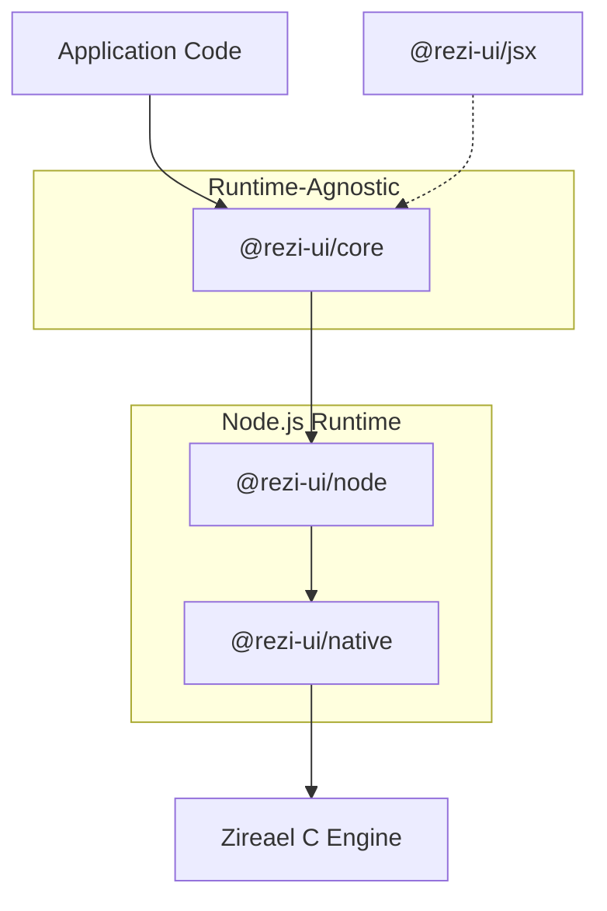

# Architecture

Rezi is built as a layered system: a runtime-agnostic UI core, a Node.js backend, and a native rendering engine.

## Runtime stack

## Data flow (high level)

1. Your `view` function produces a widget tree (`VNode`s) in `@rezi-ui/core`.
2. The core runtime computes layout, focus, and render updates.
3. The Node backend sends drawlists (ZRDL) and event batches (ZREV) across the native boundary.
4. Zireael performs terminal I/O and diff-based rendering.

## Related docs

- [Backend overview](../backend/node.md)
- [Worker model](../backend/worker-model.md)
- [Native addon](../backend/native.md)
- [Protocol overview](../protocol/index.md)
- [ZRDL drawlists](../protocol/zrdl.md)
- [ZREV event batches](../protocol/zrev.md)
