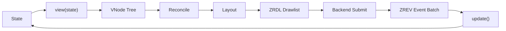

# Runtime & Layout

Rezi's runtime turns state into frames through a deterministic pipeline. This page is an index for the runtime internals and the layout model used across widgets.

## Runtime pipeline

## Runtime phases

- **Reconciliation**: compares the new VNode tree to the previous one and computes changes.
- **Layout**: resolves sizes and positions in terminal cell units.
- **Rendering**: builds ZRDL drawlists and submits them to the backend.
- **Event dispatch**: parses ZREV batches and routes input to widgets or global handlers.

## Layout model

Layout is cell-based and deterministic. Stacks (`row`, `column`) and constraints (`width`, `height`, `flex`) are the core primitives.

- [Layout guide](layout.md)

## Input & focus

Focus routing and key handling are part of the runtime contract.

- [Input & focus](input-and-focus.md)
- [Keyboard shortcuts recipe](../recipes/keyboard-shortcuts.md)

## Update contract

Update batching, commit points, and runtime error codes are defined in the lifecycle guide.

- [Lifecycle & updates](lifecycle-and-updates.md)

## Protocol boundary

The runtime talks to the engine over ZRDL and ZREV.

- [Protocol overview](../protocol/index.md)
- [Drawlists (ZRDL)](../protocol/zrdl.md)
- [Event batches (ZREV)](../protocol/zrev.md)
